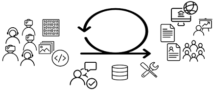

= Docs as Code

An Overview


Christine Lenhart <Christine.Lenhart@gft.com>

DevOps Event 24.01.2019


== What is Docs as Code and what does it have to do with DevOps?

Anne Gentle gives a nice answer to that:

Docs like code := 
write,  
review,  
test, 
merge, 
build, 
deploy, 
repeat.


=== Sounds familiar?

Right, just like the concept of DevOps and CI/CD

* You *write* code eh docs ( as code )
* Let someone *review* code, e.g. review as part of a pull request in Git
* Run automated *tests* -> local test, checkstyle, syntax etc.
* *Merge* code to repository
* Run one / multiple *builds* for different formats, e.g. maven/gradle build jobs in Jenkins, Teamcity, ...
* And finally *deploy* the documents, e.g. Webpage, PDF, Confluence, ...


== CI/CD Approach
 
Distributed teams, repositories?
No Problem. 
Add references to other files, images.
 
When new doc is committed an automated build gets triggered 
Documents with old screenshots get updated automatically up-to-date

=== What do you need?

* CI/CD Pipeline:
** Version control systems
*** gitLab (GFT)
** Build server:
*** Jenkins
** Generator
*** Asciidoctor (see `demo`)

=== What language for "coding"?
When introducing the "docs as/like code" approach you have to decide what language should be used

As we want to keep it simple
choose an existing designated language 
that are used in git, google, wikis etc.

Common designated language are

* Markdown .md (git)
* AsciiDoc .adoc (dpa)
* . (Google)
* ...

You can also define your own language but why not make use of the simplicity of the good documented ones?!

=== What is AsciiDoc(tor)?

[quote, Stuart Rackham]
You write an AsciiDoc document the same way you would write a normal text document.
There are no markup tags or weird format notations.
AsciiDoc files are designed to be viewed, edited and printed directly or translated to other presentation formats.

Asciidoctor is ruby based processing tool for files to html, docbook, pdf, ...


== What tools can be used?

=== Editing tools

* Plain text editors
** notepad++
** vim
...

* *IDEs*  `!!! Jippie !!!`
** IntelliJ (see `demo`)
** Visual Studio Code
** (Eclipse)
...


== And what's with diagrams?
Diagrams can also be coded 
*but*
that's is not that easy

Tools like _plantUML_ generate good sequential diagrams
but it is hard to code "beautiful" graphs


Recommendation: 

create diagrams, graphs, images with graphic editing tools and *reference* in your code to the images

```
And don't forget to put the images in the repositories so that the docs always stay up to date. :)
```

== Demo

* Editing tools:

** Notepad++
** IntelliJ

* Docs:

** Code in Asciidoc format

** Generate document

** html

(Push changes to repo)


